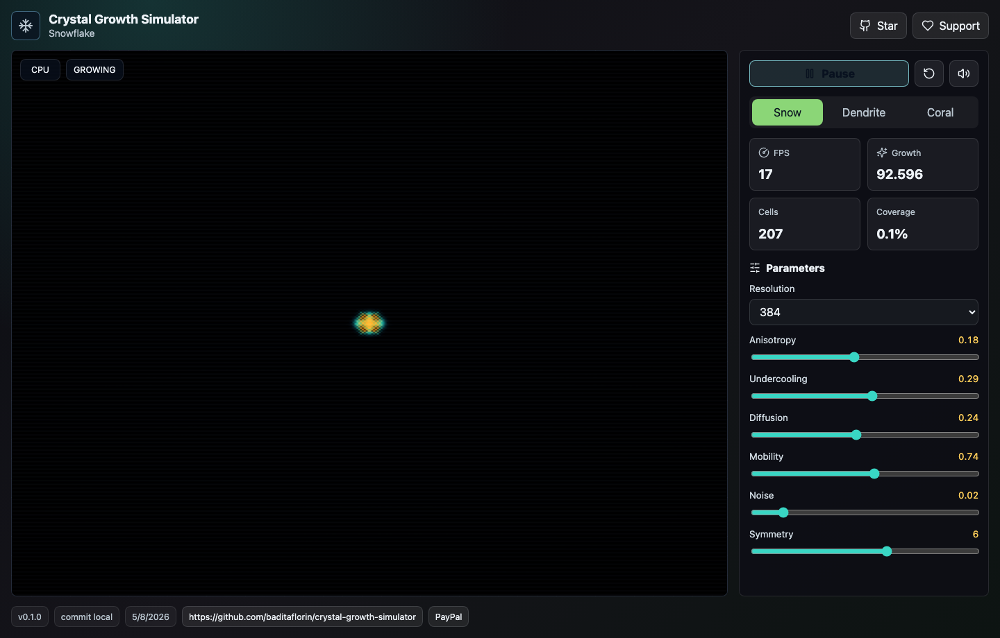
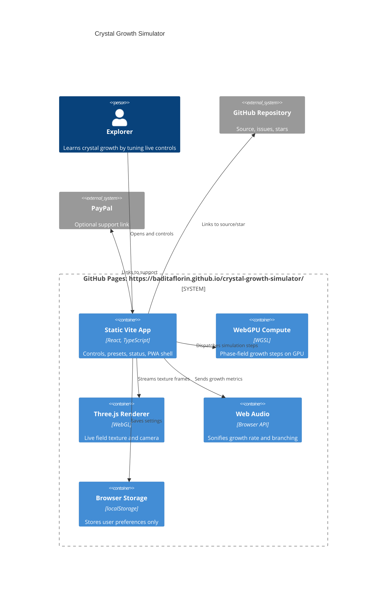

# Crystal Growth Simulator

Live browser simulator for snowflake, dendrite, and coral-like crystal growth with WebGPU visuals and sonified physics.

Live site: https://baditaflorin.github.io/crystal-growth-simulator/

Repository: https://github.com/baditaflorin/crystal-growth-simulator

Support: https://www.paypal.com/paypalme/florinbadita



## What It Is

Crystal Growth Simulator is a static GitHub Pages app that runs a phase-field-inspired growth model in the browser, renders the field with Three.js, and maps growth rhythm to Web Audio. It is built for education, science communication, and visual exploration rather than scientific-grade numerical output.

## Quickstart

```bash
npm install
make install-hooks
make dev
make test
make build
```

## Architecture



More detail: docs/architecture.md

ADRs: docs/adr/

Deploy guide: docs/deploy.md

## Versioning

The page footer shows the npm package version, build commit, build timestamp, repository link, and PayPal support link.

## Checks

```bash
make lint
make test
make smoke
```

No GitHub Actions are configured. Local hooks run linting, type checks, formatting, tests, the Pages build, Playwright smoke checks, and a gitleaks scan when available.
