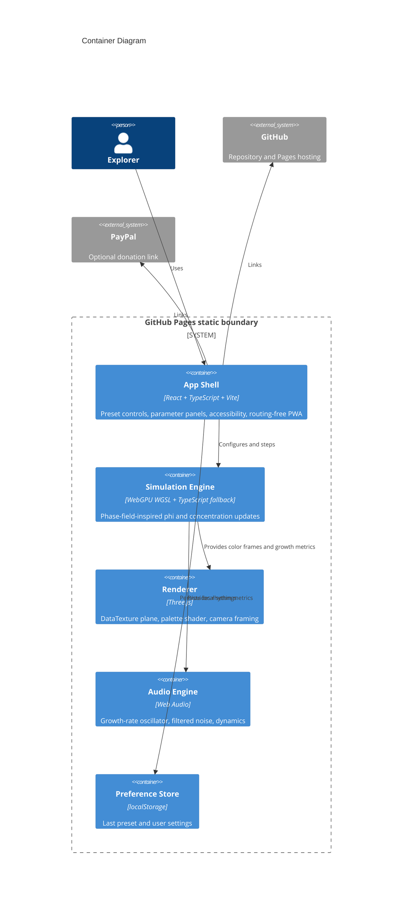

# Architecture

Crystal Growth Simulator is Mode A: a pure GitHub Pages app with no runtime backend.

The build output is committed under `docs/` so GitHub Pages can publish from `main:/docs`. The app avoids COOP/COEP requirements by not using shared memory or threaded WASM.
